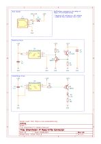
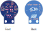

## Smartmeter IR Reader/Writer

This is an implementation of the smart reader concept created by [volkszaehler.org](https://wiki.volkszaehler.org/hardware/controllers/ir-schreib-lesekopf-ttl-ausgang).

It has been modified as follows:

- Replaced 13k resistors by 10k (as I have a lot of them in stock)
- Added an RJ11 connector with 4 pins as a connector to the microcontroller unit

This board is intended to interface with a Microcontroller unit via an RJ11 connector.

## Schematic & Board Layout

## Revision History:
- **v1.0**: Initial version (Produced: 19.08.2023; not assembled)
- **v1.1**: Corrected RJ11 socket connector (Produced: 19.09.2023; First Assembly: 06.10.2023))
- **v1.2**: Corrected misorientation of Q1/Q2 transistor pins, Board cutout and added Pin descriptions (Produced 15.10.2023)
